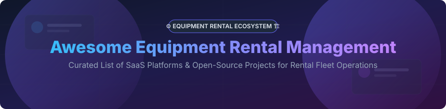

# Awesome Equipment Rental Management 🚜📦

    

## 📌 Top Equipment Rental Management Platforms Ecosystem

**Curated List of SaaS Products & Open-Source GitHub Projects**  
*Focused on Rental Inventory Management, Booking Workflows, Contract Generation, Telematics & Fleet Tracking* 🛠️⚡

**Last updated: September 2026** 📅

---

This repository tracks top **SaaS platforms** and **open-source projects** for **Equipment Rental Management**. Whether you operate construction heavy equipment dealers, AV/event rental houses, tool hire shops, or peer-to-peer equipment marketplaces, these solutions help manage inventory lifecycle, process online bookings, generate legal contracts, schedule preventative maintenance, and optimize fleet utilization. 🚚✨

---

## 📑 Table of Contents

- [📊 Sector Overview & Market Intelligence](#-sector-overview--market-intelligence)
- [☁️ SaaS / Hosted Platforms](#%EF%B8%8F-saas--hosted-platforms)
- [💻 Open-Source GitHub Projects](#-open-source-github-projects)
- [🤝 How to Contribute](#-how-to-contribute)
- [💖 Support & Sponsorship](#-support--sponsorship)
- [📈 Star History](#-star-history)
- [⚠️ Disclaimer](#%EF%B8%8F-disclaimer)

---

## 📊 Sector Overview & Market Intelligence

> **Market Size & Structure:** The global **Equipment Rental Management Software market** is estimated at **~$300M - $500M** (growing at a **7.4% CAGR** toward **$504M+ by 2031**), while serving the broader **$120B+ physical equipment rental industry**. The software sector is **highly fragmented** across niche verticals (construction, AV/event production, party rentals, medical equipment) with no single winner-take-all monopoly, driving strong demand for specialized SaaS tools and flexible open-source self-hosted solutions. 📈🔍

---

## ☁️ SaaS / Hosted Platforms

Below is a curated table of leading commercial SaaS platforms for equipment rental management, ordered by company scale (estimated annual revenue / parent valuation descending). 💰🏆

| Product 🚀 | Description 📝 | Company Scale (Rev / Valuation) 🏛️ | Pricing 💳 | Free Tier / Free Trial Limits 🎁 |
| :--- | :--- | :--- | :--- | :--- |
| **[Point of Rental](https://www.pointofrental.com/)** | Comprehensive enterprise rental management software for equipment, event, and heavy tool rental businesses. Features inventory tracking, contract management, billing, and fleet maintenance. | **~$45M Annual Revenue** | Custom quote (Tiered enterprise plans) | No free tier; demo available upon request |
| **[EZRentOut](https://www.ezrentout.com/)** | Asset & equipment rental management platform by EZO with barcode tracking, mobile apps, maintenance scheduling, and web store builder. | **~$29.5M ARR (Parent EZO)** | Starts at **$399/month** (Growth Tier) | 7-day free trial (Full access, no credit card required) |
| **[Texada](https://texada.com/)** | Enterprise rental growth platform for heavy equipment dealers and fleet rental operators. Provides telematics, contracts, and fleet analytics. | **~$18.4M Annual Revenue** | Custom quote (Scale & module based) | No free tier; custom guided demo available |
| **[Quipli](https://quipli.com/)** | Modern e-commerce and rental management platform built specifically for independent equipment rental companies. | **~$2.2M Annual Revenue** | Starts at **$299/month** | 14-day free trial (Full access) |
| **[Booqable](https://booqable.com/)** | All-in-one equipment rental software with online booking embed, inventory control, order management, and Stripe integration. | **~$1.5M Annual Revenue** | Starts at **$29/month** (Essential plan, billed annually) | 14-day free trial (Full feature access, no credit card required) |
| **[HireHop](https://hirehop.com/)** | Cloud-based equipment hire software tailored for equipment rental and production companies with availability calendars and equipment tracking. | **~$990K Annual Revenue** | Starts at **$23/user/month** (£18/mo) | 14-day free trial (Full access) |
| **[RentalMan](https://www.rentalman.com/)** | Heavy equipment ERP system by Wynne Systems (Volaris Group subsidiary) managing heavy fleet, financial accounting, and jobsite logistics. | **Enterprise / Subsidiary of Constellation Software ($50B+ Cap)** | Custom enterprise quote | No free tier or public trial; enterprise demonstration required |
| **[RentalWorks](https://www.rentalworks.com/)** | Rental software suite for tool and equipment rental operators with dispatch, billing, and stock tracking. | **Mid-Market Private** | Custom quote | 14-day free trial available |
| **[Rentle](https://rentle.io/)** *(Twice)* | Modern circular commerce and rental software focusing on self-service rentals, online booking, and fleet inventory. | **Venture-Backed Startup** | Starts at **$29/month** | Free plan available (Up to 30 orders/month) |
| **[Current RMS](https://current-rms.com/)** | Cloud-based rental management system for AV, production, and broadcast event rental houses. | **Established Private** | Starts at **$32/user/month** | 30-day free trial (Full access) |
| **[InTempo](https://www.intempo.com/)** | Modular rental software for regional equipment rental yards with fleet maintenance and point-of-sale functionality. | **Subsidiary of Volaris Group** | Custom quote | Guided demo available |
| **[RentalResult](https://www.rentalresult.com/)** | Enterprise rental software solution for construction equipment and asset management. | **Enterprise Private** | Custom quote | Guided demo available |
| **[MCS Rental Software](https://www.mcsrentalsoftware.com/)** | Global equipment rental software providing telematics integration, mobile driver apps, and contract control. | **Established Global Private** | Custom quote | Guided demo available |

---

## 💻 Open-Source GitHub Projects

Explore mature open-source equipment rental platforms, booking engines, and asset tracking repositories. Sorted by GitHub Stars_Count (descending). 🌟⭐

| Repository 📦 | GitHub_Stars 🌟 | Description 📝 | Stack / Tech 🛠️ | License 📄 |
| :--- | :--- | :--- | :--- | :--- |
| **[QloApps](https://github.com/Qloapps/QloApps)** |  | Open-source customizable reservation and booking management system for rooms, spaces, and equipment assets. | PHP, MySQL | OSL-3.0 |
| **[Shelf](https://github.com/Shelf-nu/shelf.nu)** |  | Open-source asset management infrastructure with QR tag tracking, location history, and equipment maintenance scheduling. | TypeScript, Vue, Node.js | Apache-2.0 |
| **[LibreBooking](https://github.com/LibreBooking/librebooking)** |  | Web-based booking and resource scheduling system for shared equipment, tools, and facilities. Fork of Booked Scheduler. | PHP, MySQL, PostgreSQL | GPL-3.0 |
| **[Fab-Manager](https://github.com/sleede/fab-manager)** |  | Open-source maker space and equipment rental management platform with booking, asset scheduling, and billing. | Ruby on Rails, Vue.js | AGPL-3.0 |
| **[OpenReservation](https://github.com/OpenReservation/OpenReservation)** |  | Cloud-native reservation and asset booking system with Docker & Kubernetes support. | C#, .NET Core | MIT |
| **[leihs](https://github.com/leihs/leihs)** |  | Comprehensive equipment lending, reservation, and inventory management system used by universities and institutions. | Ruby, Clojure, PostgreSQL | MIT |
| **[RentalCore](https://github.com/nbt4/rentalcore)** |  | Docker-first equipment rental management system featuring inventory tracking, job scheduling, and RBAC security. | Go, Docker | MIT |
| **[AdamRMS](https://github.com/adam-rms/adam-rms)** |  | Advanced Rental Management System for Theatre, AV & Broadcast equipment with inventory showcase & crew booking. | PHP, JavaScript, Docker | AGPL-3.0 |
| **[Louez](https://github.com/Synapsr/Louez)** |  | Modern AI-assisted equipment rental platform with storefront builder, Stripe payments, and contract automation. | Next.js 16, TypeScript, Tailwind | MIT |
| **[BoltBike](https://github.com/manjurulhoque/BoltBike)** |  | Peer-to-peer e-bike equipment rental platform with marketplace earnings tracking and Stripe integration. | Django, React, PostgreSQL | MIT |
| **[Rental-odoo](https://github.com/Hemil-Hansora/Rental-odoo)** |  | MERN stack equipment booking portal with interactive calendar, admin dashboard, and Stripe payments. | React, Node.js, Express, MongoDB | MIT |

---

## 🤝 How to Contribute

Contributions to expand this curated list are warmly welcomed! 🌟

1. **Fork** this repository. 🍴
2. **Add/Edit** entries in `README.md` following the table formatting. ✍️
3. Include factual data: platform name, official URL, description, pricing details, and repository star links. 📌
4. Submit a **Pull Request** with a brief summary of additions. 🚀

---

## 💖 Support & Sponsorship

If you find this repository helpful for your business, fleet operations, or tech stack research, please consider supporting the project! ⭐

- **Star & Share:** Give this repository a ⭐ star and share it with your network!
- **Sponsor:** Buy me a coffee or support ongoing open-source curation via [GitHub Sponsors](https://github.com/sponsors/ishandutta2007). ☕✨

---

## 📈 Star History

---

## ⚠️ Disclaimer

- This is a **community-curated** list for informational and educational purposes — not an official endorsement. ℹ️
- Equipment rental management platforms handle financial, inventory, and customer contracts; ensure compliance with local commercial regulations. ⚖️
- Self-hosted open-source software requires security maintenance and backup policies. 🔒
